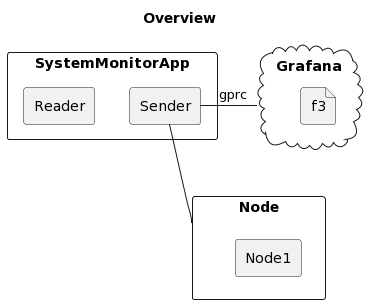
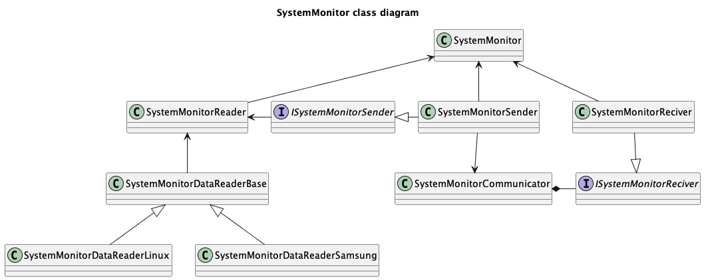

# System Monitor

## Table of Contents
- [System Monitor](#system-monitor)
  - [Table of Contents](#table-of-contents)
  - [Purpose](#purpose)
  - [Build](#build)
  - [Features](#features)
  - [Class Diagram](#class-diagram)

---

## Purpose
The System Monitor application is designed to collect and analyze various state information of a computer system. Its primary function is to monitor real-time statistics like CPU usage, memory usage, disk utilization, and network traffic. Additionally, this application facilitates the display of this data through visualization tools such as Grafana, providing an intuitive and user-friendly interface for users to understand and manage their system's performance effectively.

## Build
To build this application, you can either use the provided `build.sh` script or perform a manual build. The `build.sh` script simplifies the process by automating various steps required for compilation and setup. If you prefer to build manually, ensure that you have all the necessary dependencies installed and follow the standard C++ build process for your system.

## Features
[List the key features of your System Monitor application here. This might include specific functionalities, system compatibility, performance metrics, etc.]

## Class Diagram

